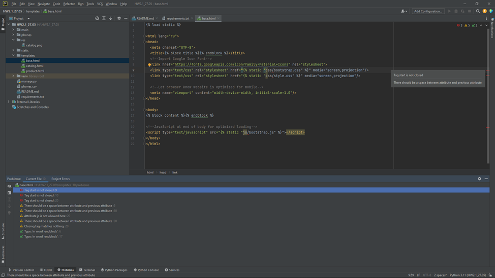
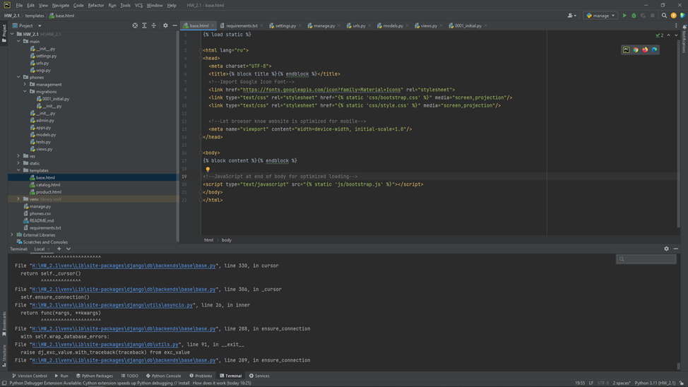
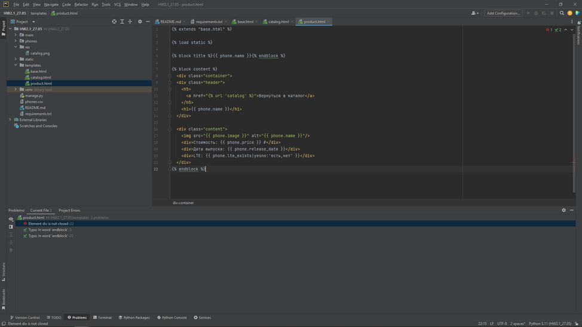
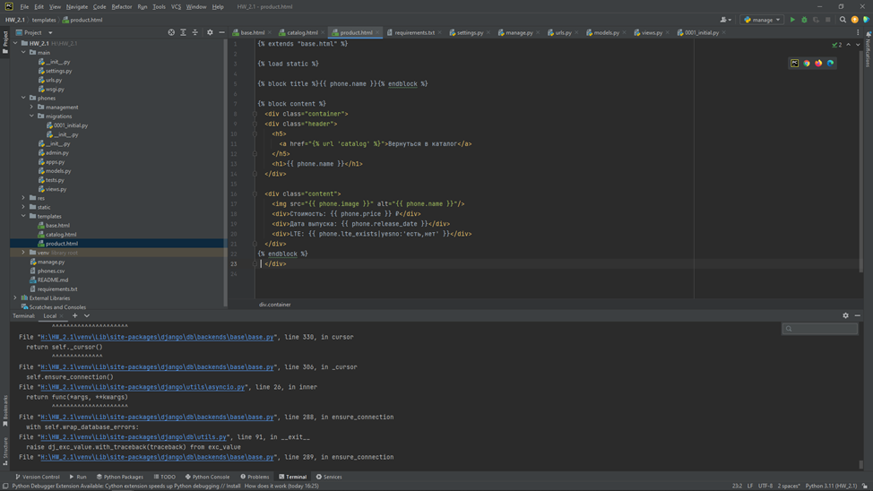

# Выгрузка каталога товаров из csv-файла с сохранением всех позиций в базе данных

## Задание

Есть некоторый [csv-файл](./phones.csv), который выгружается с сайта-партнера. Этот сайт занимается продажей телефонов.

Мы же являемся их региональными представителями, поэтому нам необходимо взять данные из этого файла и отобразить их на нашем сайте на странице каталога, с их предварительным сохранением в базу данных.

## Реализация

Что необходимо сделать

- В файле `models.py` нашего приложения создаём модель Phone с полями `id`, `name`, `price`, `image`, `release_date`, `lte_exists` и `slug`. Поле `id` — должно быть основным ключом модели.
- Значение поля `slug` должно устанавливаться слагифицированным значением поля `name`.
- Написать скрипт для переноса данных из csv-файла в модель `Phone`.
  Скрипт необходимо разместить в файле `import_phones.py` в методе `handle(self, *args, **options)`.
  Подробнее про подобные скрипты (django command) можно почитать [здесь](https://docs.djangoproject.com/en/3.2/howto/custom-management-commands/) и [здесь](https://habr.com/ru/post/415049/).
- При запросе `<имя_сайта>/catalog` должна открываться страница с отображением всех телефонов.
- При запросе `<имя_сайта>/catalog/iphone-x` должна открываться страница с отображением информации по телефону. `iphone-x` — это для примера, это значние берётся из `slug`.
- В каталоге необходимо добавить возможность менять порядок отображения товаров: по названию в алфавитном порядке и по цене по убыванию и по возрастанию.

Шаблоны подготовлены, ваша задача — ознакомиться с ними и корректно написать логику.

## Ожидаемый результат


## Подсказка

Для переноса данных из файла в модель можно выбрать один из способов:

- воспользоваться стандартной библиотекой языка Python: `csv` (рекомендуется).
- построчно пройтись по файлу и для каждой строки сделать соответствующую запись в БД.

Для реализации сортировки можно брать параметр `sort` из `request.GET`.

Пример запросов:

- `<имя_сайта>/catalog?sort=name` — сортировка по названию;
- `<имя_сайта>/catalog?sort=min_price` — сначала отображать дешёвые.

## Документация по проекту

Для запуска проекта необходимо

Установить зависимости:

```bash
pip install -r requirements.txt
```

Выполнить следующие команды:

- Команда для создания миграций приложения для базы данных

```bash
python manage.py migrate
```

- Команда для загрузки данных из csv в БД

```bash
python manage.py import_phones
```

- Команда для запуска приложения

```bash
python manage.py runserver
```

- При создании моделей или их изменении необходимо выполнить следующие команды:

```bash
python manage.py makemigrations
python manage.py migrate
```


КОММЕНТАРИИ К ДОРАБОТКЕ ДЗ:
 1) В файле models.py нашел и исправил свои ошибки 
(были заданы строковые значения default переменной типа int).
 2) В шаблоне 'base' строка 9 

было: href=""

должно быть: href=""

Если есть кавычки внутри кавычек, то они должны быть разного типа

Строки 10 и 20 аналогично, pycharm показывал это ошибкой. 

 3) В шаблоне 'product' строка 23 не хватает закрывающегося тега '</ d i v >'

Скриншоты к шаблона в формате было/стало






 4) 'у вас в настройках у вас почему-то закомментирован порт подключения к бд'  

В лекциях примеры были без указания порта, поэтому, чтобы избежать возможной ошибки 
пробовал сделать и с указанием порта и без него. При повторении действий из лекций базу 
получалось создать без указания порта. 

При создании команды 'python manage.py migrate' появляются следующие ошибки. Получить информацию с них мне затруднительно, 
т.к. они ведут на встроенные в django файлы. 

Использование открытых источников интернета также не принесло пользы. 

Traceback (most recent call last):
File "H:\HW_2.1\venv\Lib\site-packages\django\db\backends\base\base.py", line 289, in ensure_connection
    self.connect()
  
File "H:\HW_2.1\venv\Lib\site-packages\django\utils\asyncio.py", line 26, in inner
    return func(*args, **kwargs)
           ^^^^^^^^^^^^^^^^^^^^^

File "H:\HW_2.1\venv\Lib\site-packages\django\db\backends\base\base.py", line 270, in connect
    self.connection = self.get_new_connection(conn_params)
                      ^^^^^^^^^^^^^^^^^^^^^^^^^^^^^^^^^^^^

File "H:\HW_2.1\venv\Lib\site-packages\django\utils\asyncio.py", line 26, in inner
    return func(*args, **kwargs)
           ^^^^^^^^^^^^^^^^^^^^^

File "H:\HW_2.1\venv\Lib\site-packages\django\db\backends\postgresql\base.py", line 275, in get_new_connection
    connection = self.Database.connect(**conn_params)
                 ^^^^^^^^^^^^^^^^^^^^^^^^^^^^^^^^^^^^

File "H:\HW_2.1\venv\Lib\site-packages\psycopg2\__init__.py", line 122, in connect
    conn = _connect(dsn, connection_factory=connection_factory, **kwasync)
           ^^^^^^^^^^^^^^^^^^^^^^^^^^^^^^^^^^^^^^^^^^^^^^^^^^^^^^^^^^^^^^^

psycopg2.OperationalError

The above exception was the direct cause of the following exception:

Traceback (most recent call last):
  
File "H:\HW_2.1\manage.py", line 15, in <module>
    execute_from_command_line(sys.argv)

File "H:\HW_2.1\venv\Lib\site-packages\django\core\management\__init__.py", line 442, in execute_from_command_line
    utility.execute()

File "H:\HW_2.1\venv\Lib\site-packages\django\core\management\__init__.py", line 436, in execute
    self.fetch_command(subcommand).run_from_argv(self.argv)

File "H:\HW_2.1\venv\Lib\site-packages\django\core\management\base.py", line 412, in run_from_argv
    self.execute(*args, **cmd_options)

File "H:\HW_2.1\venv\Lib\site-packages\django\core\management\base.py", line 458, in execute
    output = self.handle(*args, **options)
             ^^^^^^^^^^^^^^^^^^^^^^^^^^^^^

File "H:\HW_2.1\venv\Lib\site-packages\django\core\management\base.py", line 106, in wrapper
    res = handle_func(*args, **kwargs)
          ^^^^^^^^^^^^^^^^^^^^^^^^^^^^

File "H:\HW_2.1\venv\Lib\site-packages\django\core\management\commands\migrate.py", line 117, in handle
    executor = MigrationExecutor(connection, self.migration_progress_callback)
               ^^^^^^^^^^^^^^^^^^^^^^^^^^^^^^^^^^^^^^^^^^^^^^^^^^^^^^^^^^^^^^^

File "H:\HW_2.1\venv\Lib\site-packages\django\db\migrations\executor.py", line 18, in __init__
    self.loader = MigrationLoader(self.connection)
                  ^^^^^^^^^^^^^^^^^^^^^^^^^^^^^^^^

File "H:\HW_2.1\venv\Lib\site-packages\django\db\migrations\loader.py", line 58, in __init__
    self.build_graph()

File "H:\HW_2.1\venv\Lib\site-packages\django\db\migrations\loader.py", line 235, in build_graph
    self.applied_migrations = recorder.applied_migrations()
                              ^^^^^^^^^^^^^^^^^^^^^^^^^^^^^

File "H:\HW_2.1\venv\Lib\site-packages\django\db\migrations\recorder.py", line 81, in applied_migrations
    if self.has_table():
       ^^^^^^^^^^^^^^^^

File "H:\HW_2.1\venv\Lib\site-packages\django\db\migrations\recorder.py", line 57, in has_table
    with self.connection.cursor() as cursor:
         ^^^^^^^^^^^^^^^^^^^^^^^^

File "H:\HW_2.1\venv\Lib\site-packages\django\utils\asyncio.py", line 26, in inner
    return func(*args, **kwargs)
           ^^^^^^^^^^^^^^^^^^^^^

File "H:\HW_2.1\venv\Lib\site-packages\django\db\backends\base\base.py", line 330, in cursor
    return self._cursor()
           ^^^^^^^^^^^^^^

File "H:\HW_2.1\venv\Lib\site-packages\django\db\backends\base\base.py", line 306, in _cursor
    self.ensure_connection()

File "H:\HW_2.1\venv\Lib\site-packages\django\utils\asyncio.py", line 26, in inner
    return func(*args, **kwargs)
           ^^^^^^^^^^^^^^^^^^^^^

File "H:\HW_2.1\venv\Lib\site-packages\django\db\backends\base\base.py", line 288, in ensure_connection
    with self.wrap_database_errors:

File "H:\HW_2.1\venv\Lib\site-packages\django\db\utils.py", line 91, in __exit__
    raise dj_exc_value.with_traceback(traceback) from exc_value

File "H:\HW_2.1\venv\Lib\site-packages\django\db\backends\base\base.py", line 289, in ensure_connection
    self.connect()

File "H:\HW_2.1\venv\Lib\site-packages\django\utils\asyncio.py", line 26, in inner
    return func(*args, **kwargs)
           ^^^^^^^^^^^^^^^^^^^^^

File "H:\HW_2.1\venv\Lib\site-packages\django\db\backends\base\base.py", line 270, in connect
    self.connection = self.get_new_connection(conn_params)
                      ^^^^^^^^^^^^^^^^^^^^^^^^^^^^^^^^^^^^

File "H:\HW_2.1\venv\Lib\site-packages\django\utils\asyncio.py", line 26, in inner
    return func(*args, **kwargs)
           ^^^^^^^^^^^^^^^^^^^^^

File "H:\HW_2.1\venv\Lib\site-packages\django\db\backends\postgresql\base.py", line 275, in get_new_connection
    connection = self.Database.connect(**conn_params)
                 ^^^^^^^^^^^^^^^^^^^^^^^^^^^^^^^^^^^^

File "H:\HW_2.1\venv\Lib\site-packages\psycopg2\__init__.py", line 122, in connect
    conn = _connect(dsn, connection_factory=connection_factory, **kwasync)
           ^^^^^^^^^^^^^^^^^^^^^^^^^^^^^^^^^^^^^^^^^^^^^^^^^^^^^^^^^^^^^^^

django.db.utils.OperationalError
